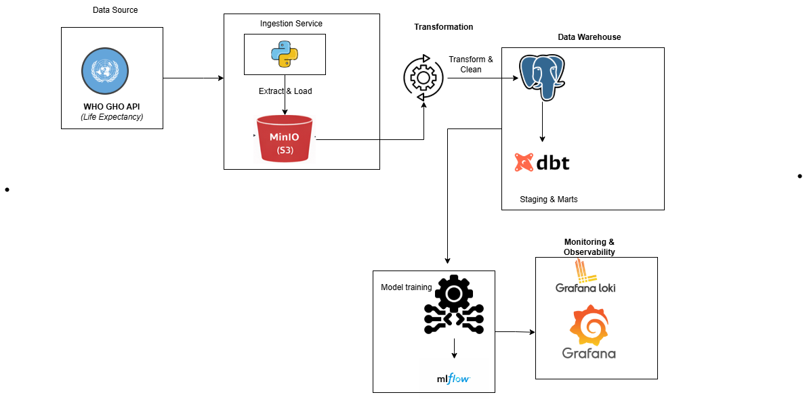

# Health Data & ML Platform (WHO GHO)

Containerized pipeline: WHO GHO API → MinIO → PostgreSQL → dbt → ML (scikit-learn + MLflow). Observability: Loki, Promtail, Grafana.

## High-Level Architecture



---

## Clone

```bash
git clone https://github.com/Ngoga-Musagi/health-data-platform.git
cd health-data-platform
```

---

## How to Run

**Prerequisites:** Docker, Bash (e.g. Git Bash on Windows).

```bash
chmod +x run.sh   # once
./run.sh up       # start infra (MinIO, Postgres, MLflow, Loki, Promtail, Grafana)
./run.sh pipeline # run full pipeline: ingest → transform → dbt → ML
```

**Individual steps** (after `./run.sh up`):

| Command | Step |
|--------|------|
| `./run.sh ingest` | WHO API → MinIO (JSON) |
| `./run.sh transform` | MinIO → PostgreSQL + DQ |
| `./run.sh dbt-run` | dbt models |
| `./run.sh dbt-test` | dbt tests |
| `./run.sh ml` | Train & log models to MLflow |

Quick transform test: `docker compose run --rm -e MAX_ROWS=5000 transformer`

**Stop:** `./run.sh down`

---

## UIs (after pipeline)

| Service | URL | Login |
|---------|-----|--------|
| **Grafana** | http://localhost:3000 | admin / admin |
| **MLflow** | http://localhost:5000 | — |
| **MinIO** | http://localhost:9001 | minioadmin / minioadmin |

- **Grafana + Loki:** Explore → select Loki → e.g. `{container="transformer"}`.
- **PostgreSQL:** localhost:5432, db `warehouse`, user `warehouse_user`, password `warehouse_pass`; tables: `health_life_expectancy`, `mart_country_life_expectancy`.

---

## Tests

**In Docker** (recommended; uses `postgres` host):

```bash
./run.sh up        # start Postgres (and optionally run pipeline to load data)
./run.sh test      # unit + integration (integration needs data: run pipeline first)
```

**Locally:** `pip install -r tests/requirements.txt` then `pytest tests/ -v`. Integration test needs Postgres with data; use `POSTGRES_HOST=localhost` if Postgres is in Docker.

---

## Project Structure

```
├── ingestion/         # WHO API → MinIO
├── transformations/   # MinIO → PostgreSQL
├── warehouse/         # Postgres init
├── dbt/               # Staging + marts
├── ml/                # Training + MLflow
├── observability/     # Promtail, Grafana provisioning
├── tests/
├── docker-compose.yml
├── run.sh
├── README.md
├── REPORT.md
└── DESIGN_APPENDIX.md
```
